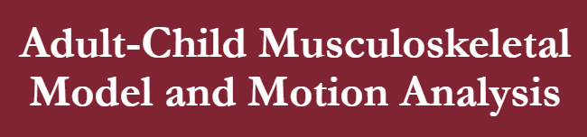

# 2021 MR Final Project

    </img>

Final project for the course of Medical Robotics 2020/2021.

>Student: Alessandro Lambertini Mat: `1938390`;
>
>Student: Denise Landini Mat: `1938388`;
>>
>Student: Catia Mat: `None`;

## 📝 Assignment

1.	Convert the data from file \*.c3d to \*.trc and \*.mot;
2.	Load data from file \*.trc and \*.mot;
3.  Fill the Gaps;
4.  Filter the data;
5.  Scaling the Muscoloskeletal Model;
6.  Create the kinematic model;
7.  Create the dynamic model;
8.  Plot the \*.trc data and the model;
9.  Analize Force, Point of contact and Moment in the \*.mot files;
10.  Analize the gait cycle;
11.  Analize the stability of the subject.

## 💾 Dataset

-   18 marches for Sirine
-   6 marches for Lina

(This dataset is not sharable, the files inside: "in - Lina", "in - Sirine", "processedData - Lina" and "processedData - Sirine" are data generated by me)

## 📜 Report

-   report [Link 🔗](./Report.pdf)

-   presentation [Link 🔗](./Presentation.pdf)

    In thise file you can read more about the code and the result of the project.

## 💯 Final score:

Score: `--/30`

## 🙋 Info

for any doubt or clarification contact me on:

-   send me an email at: lambertini.1938390@studenti.uniroma1.it
-   send me a DM on instagram [Link 🔗](https://www.instagram.com/lambertinialessandro/)

## 🎞️ Snapshots

    </img>
     

